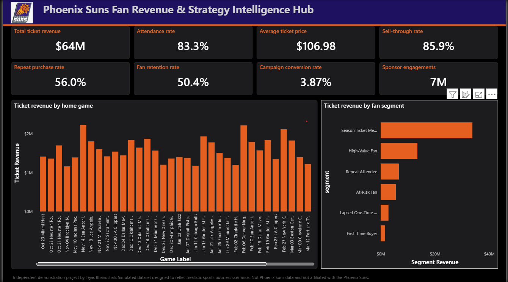
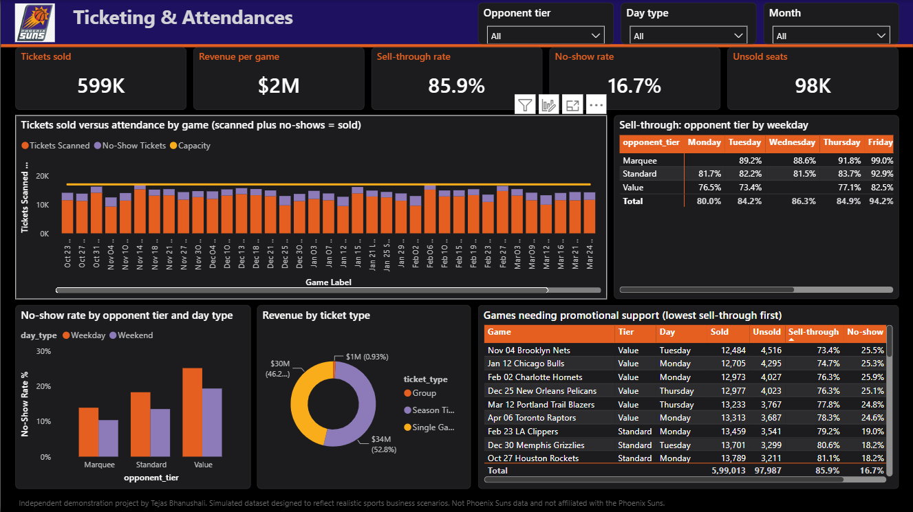
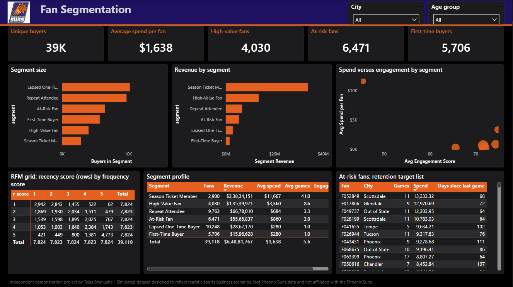
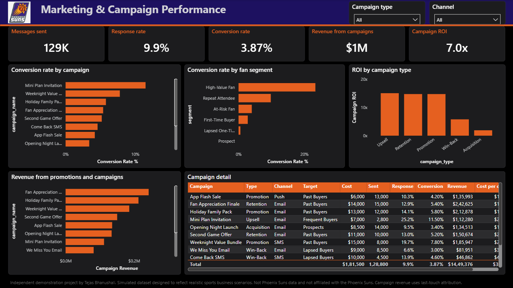
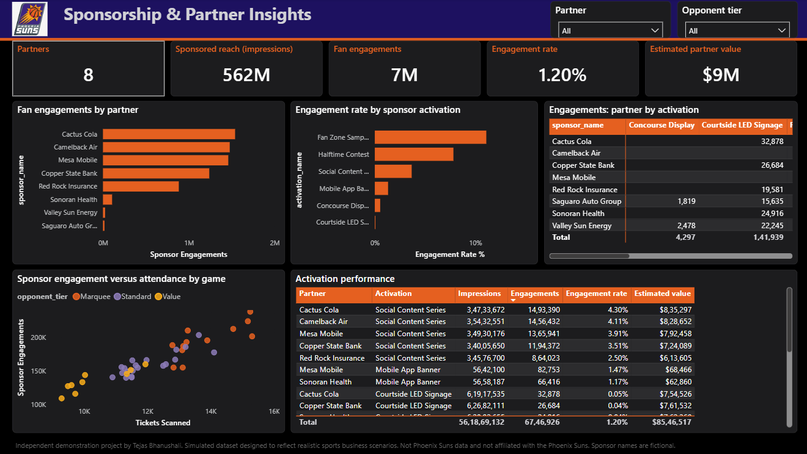
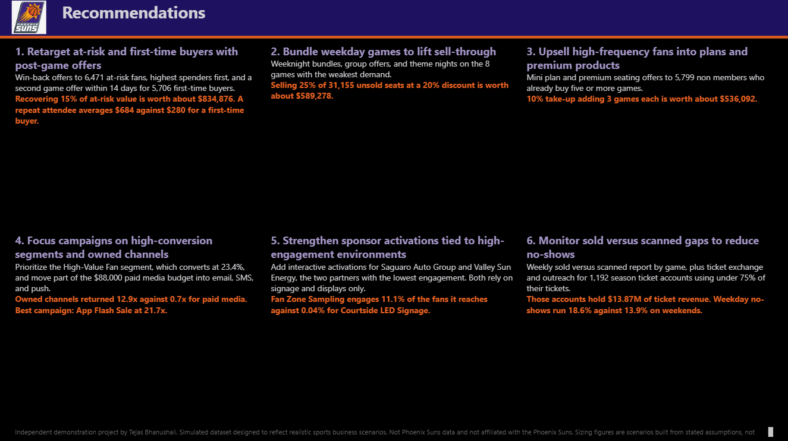

# Phoenix Suns Fan Revenue & Strategy Intelligence Hub

A business analytics project showing how a professional basketball organization could use fan, ticketing,
attendance, marketing, and sponsorship data to improve revenue, retention, and engagement.

**Stack:** Python (pandas, NumPy, Matplotlib, ReportLab), SQL (SQLite), Power BI (DAX, Power Query)

> **Simulated data.** This is an independent demonstration project. It uses a simulated dataset designed to
> reflect realistic sports business scenarios and to demonstrate an analytical approach. It is not Phoenix Suns
> data, the schedule is illustrative, and no figure describes actual team performance. Sponsor names are
> fictional. Not affiliated with or endorsed by the Phoenix Suns.

## Deliverables

| Deliverable | Location |
|---|---|
| Power BI dashboard, 6 pages | `powerbi/Phoenix_Suns_Strategy_Hub.pbip` (save as .pbix after refresh) |
| Business report, 7 pages | `outputs/Phoenix_Suns_Fan_Revenue_Strategy_Report.pdf` |
| One page executive summary | `outputs/executive_summary.md` |
| Video walkthrough script | `docs/video_script.md` |

## Business questions

1. Which games need promotional support, and why?
2. Which fan segments should receive retention campaigns?
3. Which fans are ready for a higher value ticket product?
4. Which campaign types and segments convert best?
5. Which sponsor activations generate the strongest engagement?

## Data model

| Table | Grain | Key columns |
|---|---|---|
| fans | One row per fan | fan_id, age_group, city, acquisition_channel, membership_status, join_date |
| games | One row per home game | game_id, opponent, game_date, weekday, game_type, home_away, opponent_tier, capacity |
| ticket_sales | One row per transaction | transaction_id, fan_id, game_id, ticket_type, quantity, ticket_revenue, purchase_date, purchase_channel |
| attendance | One row per transaction | attendance_id, fan_id, game_id, tickets_scanned, scanned_flag |
| campaigns | One row per campaign | campaign_id, campaign_name, channel, target_segment, send_date, impressions, clicks, conversions, revenue_generated |
| campaign_responses | One row per fan per campaign | response_id, campaign_id, fan_id, opened, clicked, converted |
| sponsorship | One row per activation per game | sponsor_id, activation_name, game_id, impressions, engagements, estimated_value |
| fan_segments | One row per fan (derived) | segment, RFM scores, engagement_score, retention flags |

## Pipeline

| Step | Script | What it does |
|---|---|---|
| 1 | `src/01_generate_data.py` | Generates the simulated dataset with injected data quality problems |
| 2 | `src/02_clean_and_load.py` | Cleans, validates (16 checks), loads SQLite, builds RFM segments |
| 3 | `src/03_analysis.py` | Runs 12 SQL queries, builds charts, writes findings and the video script |
| 4 | `src/04_build_powerbi.py` | Builds the Power BI project: data model, 42 DAX measures, 6 pages |
| 5 | `src/05_build_report.py` | Builds the 7 page PDF report |

## Run it (Windows CMD)

```
cd %USERPROFILE%\Downloads\phoenix-suns-strategy-hub
python -m venv venv
venv\Scripts\activate
pip install -r requirements.txt
python run_pipeline.py
start "" "powerbi\Phoenix_Suns_Strategy_Hub.pbip"
```

In Power BI Desktop click **Refresh**, then apply `powerbi\theme.json`. Full steps: `powerbi/POWER_BI_GUIDE.md`.

Metric definitions and segment rules: `docs/metric_definitions.md`

## Dashboard






